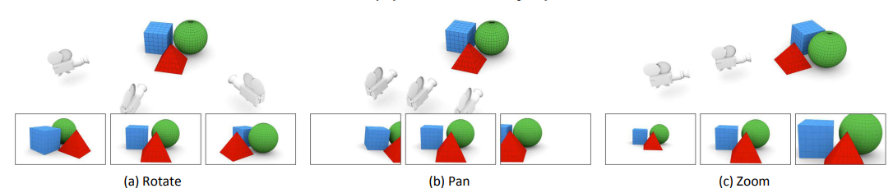
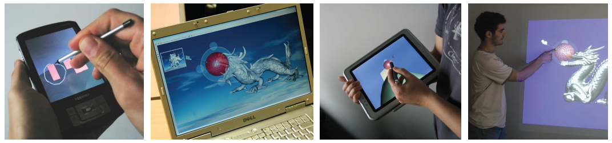

## Academic report

### Introducción:

El Antialiasing (suavizado, antiescalonamiento o suavizado de bordes) son un conjunto de tecnicas diferentes las cuales quieren evitar el solapamiento de los bordes debida a representar una señal de alta resolución en un monitor de baja resolución.

### Literatura:

#### Métodos de AA:

##### Navegación: 
Se refiere a la tarea motora de mover el punto de vista del usuario a través de un entorno; incluye un componente cognitivo: orientación.

Los entornos 3D interactivos suelen representar más espacio del que se puede ver desde un solo punto. Los usuarios deben poder moverse dentro del entorno para obtener diferentes vistas de la escena. Este proceso de desplazarse por un entorno virtual mientras se realiza un seguimiento del propio paradero y los objetivos de la tarea es el tema de una serie de técnicas a las que a menudo se hace referencia con nombres como orientación, locomoción, navegación y cámara.

Hay que resaltar que es difícil desarrollar una técnica eficaz para la navegación en entornos 3D interactivos. En primer lugar, el control del punto de vista implica seis grados de libertad (6DOF): tres dimensiones para la ubicación posicional (traslación) y tres para la ubicación angular (rotación).

Segun algunas literaturas podemos agrupoar 4 tipos de movimiento de punto de vista para espacios de trabajo 3D interactivos:

**Movimiento general:** Movimiento exploratorio, como caminar a través de una simulación de un diseño arquitectónico 

**Movimiento dirigido:** Movimiento con respecto a un objetivo específico, como moverse para examinar un detalle de un modelo de ingeniería.

**Movimiento de coordenadas especificado:**  Movimiento a una posición y orientación precisas, como una posición de visualización específica en relación con un modelo CAD: el usuario debe proporcionar la posición y orientación exactas de su destino. 

**Movimiento de trayectoria especificado:** Movimiento a lo largo de una trayectoria de posición y orientación, como el movimiento de una cámara cinematográfica (corresponde al objetivo Maniobra de Bowman et al. y al objetivo Inspección de Tan et al.).

##### Selección y manipulación: 
Se refiere a las técnicas para elegir un objeto y especificar su posición, orientación y escala.
Las técnicas de interacción para la manipulación 3D incluyen tres tareas fundamentales: traducción de objetos (posicionamiento), rotación de objetos y escalado de objetos.

##### Control del sistema:
Se refiere a la comunicación entre el usuario y el sistema que no forma parte del entorno virtual.

#### Metodos