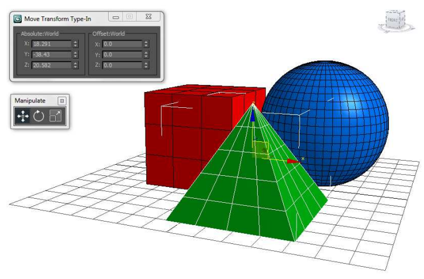
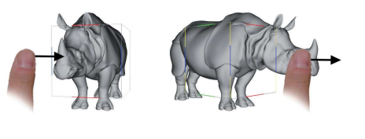

# Investigación sobre interacciónes de usuario en 3D
(A Survey of Interaction Techniques for Interactive 3D Environments) - Jacek Jankowski, Martin Hachet
## Academic report

### Introducción:

Teniendo en cuenta la tematica adelantada en clase, y su amplio espectro, decidimos enfocarnos en las interacciones de usuario en 3D.
Mas especificamente las interacciones hombre maquina dentro de un espacio virtual simulado en la computadora. Y es que a pesar de que todos 
hemos crecido y vivido en un entorno 3D y por tanto hemos desarrollado habilidades para interactuar en el mismo, a menudo nos resulta difícil interacturar en entronos 3D interactivos, y segun Jankowski[1] frecuentemente esto es resultado de una interfaz de usuario mal diseñada o debido a una selección inadecuada de técnicas de interacción.

### Literatura:

#### Entornos 3D:

Se definen los entornos 3D interactivos como representaciones informáticas del mundo real o espacios imaginarios a través de los cuales los usuarios pueden navegar y en los que pueden interacturar con objetos en tiempo real. A diferencia de los entornos virtuales inmersivos , que utilizan pantallas especializadas y dispositivos de interacción, como pantallas montadas en la cabeza, para crear una sensación de presencia para los usuarios dentro del mundo virtual, los entornos 3D interactivos no se limitan al contexto inmersivo y aprovechan los recursos comunes y general de hardware, es decir mouse y teclado como multi_touch input.

Tendremos en cuenta la clasificación de las interacciones en un ambiente interactivo 3D que encontramos en el libro de Jankowski[1] que habla de 3 tareas de interaccion universales: Navegación, Selección y manipulación, y Control de sistema. 

##### Navegación: 
Se refiere a la tarea motora de mover el punto de vista del usuario a través de un entorno; incluye un componente cognitivo: orientación.

Los entornos 3D interactivos suelen representar más espacio del que se puede ver desde un solo punto. Los usuarios deben poder moverse dentro del entorno para obtener diferentes vistas de la escena. Este proceso de desplazarse por un entorno virtual mientras se realiza un seguimiento del propio paradero y los objetivos de la tarea es el tema de una serie de técnicas a las que a menudo se hace referencia con nombres como orientación, locomoción, navegación y cámara.

Hay que resaltar que es difícil desarrollar una técnica eficaz para la navegación en entornos 3D interactivos. En primer lugar, el control del punto de vista implica seis grados de libertad : tres dimensiones para la ubicación posicional (traslación) y tres para la ubicación angular (rotación).

Segun algunas literaturas podemos agrupoar 4 tipos de movimiento de punto de vista para espacios de trabajo 3D interactivos:

**Movimiento general:** Movimiento exploratorio, como caminar a través de una simulación de un diseño arquitectónico 

**Movimiento dirigido:** Movimiento con respecto a un objetivo específico, como moverse para examinar un detalle de un modelo de ingeniería.

**Movimiento de coordenadas especificado:**  Movimiento a una posición y orientación precisas, como una posición de visualización específica en relación con un modelo CAD: el usuario debe proporcionar la posición y orientación exactas de su destino. 

**Movimiento de trayectoria especificado:** Movimiento a lo largo de una trayectoria de posición y orientación, como el movimiento de una cámara cinematográfica (corresponde al objetivo Maniobra de Bowman et al. y al objetivo Inspección de Tan et al.).

##### Selección y manipulación: 
Otra tarea típica que se realiza en un entorno virtual 3D es la selección de objetos y su manipulación directa mediante la especificación su posición, orientación y escala. Encontramos que las técnicas de interacción mas comunes en la literatura para la manipulación 3D  incluyen tres tareas fundamentales: traducción de objetos (posicionamiento), rotación de objetos y escalado de objetos.
Las técnicas de interacción para la manipulación 3D incluyen tres tareas fundamentales: traducción de objetos (posicionamiento), rotación de objetos y escalado de objetos.

###### Seleccion de objetos:
La forma más común de seleccionar objetos en los VE de escritorio es colocar el cursor del mouse sobre un objeto dado y hacer clic en un botón del mouse. La técnica se basa en la proyección de rayos (ray casting); utiliza el rayo desde el punto del ojo a través del píxel actualmente seleccionado por el puntero del mouse para encontrar el primer punto de intersección con la escena (la superficie del objetivo o su superficie aproximada, por ejemplo, el cuadro delimitador). Si el rayo virtual se cruza con un objeto, se puede seleccionar para una mayor manipulación.

###### Manipulación de objeto:

La manipulación de objetos es otra tarea básica que se realiza en un entorno virtual 3D, especialmente durante la construcción de escenas. Al diseñar una escena con múltiples objetos, los usuarios tienen que realinear y ajustar varias partes repetidamente. Es importante proporcionar una técnica de manipulación de objetos eficiente.

##### Control del sistema:
Se refiere a la comunicación entre el usuario y el sistema que no forma parte del entorno virtual.

Se puede enfocar en una tarea en la que se aplica un comando para cambiar el estado del sistema o el modo de interacción .Se  señala que aunque el movimiento del punto de vista y la selección/manipulación se han estudiado ampliamente, se ha investigado muy poco sobre las tareas de control del sistema. Sin embargo, las técnicas de control de aplicaciones se han estudiado intensamente durante los últimos 40 años en las interfaces gráficas de usuario WIMP 2D "apuntar y hacer clic" (interfaces basadas en ventanas, íconos, menús y un dispositivo señalador, generalmente un mouse).
######

#### Metodos
