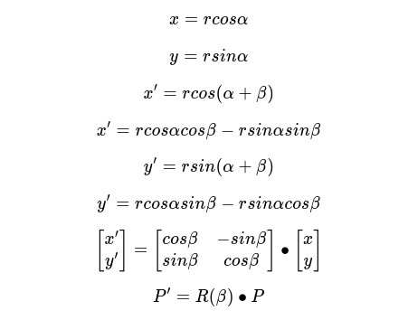
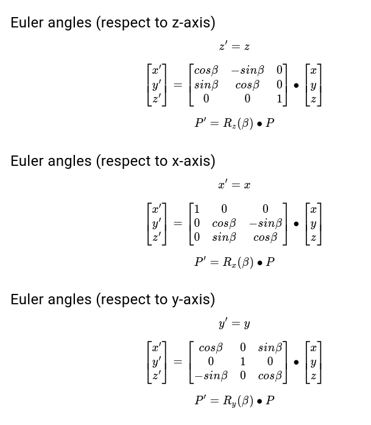

# Creating a Matrix Transformation based cube with p5.js

## Academic report

### Introducción:

Durante el desarrollo del workshop, buscamos una manera didáctica de llevar a cabo una representación gráfica de la implementación de transformaciones matriciales, y finalmente se planteó que un _Cubo de Rubik_ puede involucrar varios de estos conceptos, especialmente si se habla de *Transformaciones Lineales*.

### Literatura:

#### Transformaciones Lineales
Como se puede imaginar, hay una cantidad inimaginablemente enorme de transformaciones posibles, la mayoría de las cuales sería bastante complicado pensar en ellas. Afortunadamente, el álgebra lineal suele estar limitada a un tipo especial de transformación que es más fácil de entender: las transformaciones lineales.

Visualmente, esto significa que toda la cuadrícula de puntos 2d "sigue" con î y ĵ, por así decirlo. Puedes saber que una transformación es lineal si todas esas líneas de cuadrícula que comenzaron paralelas y espaciadas uniformemente permanecen paralelas y espaciadas uniformemente (¿por qué?). En realidad, es un poco más limitado que eso. Si una transformación es lineal, también debe fijar el origen en su lugar.

#### Matriz de Rotación
##### Rotación 2D

<video width="500" height="350" controls><source src="https://3b1b-posts.us-east-1.linodeobjects.com//content/lessons/2016/linear-transformations/rotate_about_origin.mp4#t=0.001"><video/>

##### Rotación 3D

#### p5.js:

Es una biblioteca de JavaScript para la codificación creativa, con un enfoque en la realización de la codificación accesible e inclusiva para artistas, diseñadores, educadores, principiantes y cualquier otra persona. P5.js es gratuito y de código abierto porque la filosofia de los creadores es que el  software, y las herramientas para aprenderlo, deben ser accesibles para todos.(p5js.org)

#### Referencias
[3 blue 1 Brown - Linear Transformations](https://www.3blue1brown.com/lessons/linear-transformations)

#### Metodos

