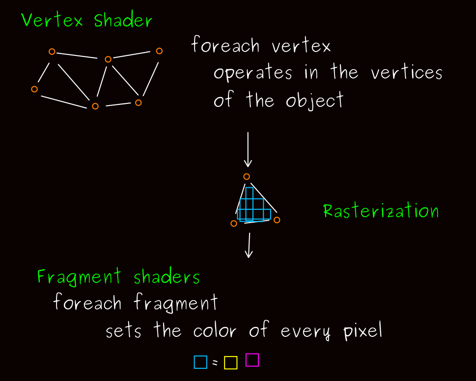

# Shaders 

#### Fragment Shaders
Los *Fragment Shaders* son aquellos que procesan un fragmento (por ejemplo, un píxel) generado por la *Rasterización* como un conjunto de colores y un valor de profundidad. Por lo tanto, estos son conjuntos de instrucciones que deben actuar al mismo tiempo por cada uno de los píxeles de la pantalla y se comportan diferente dependiendo de su posición en la pantalla.

#### Referencias 📚
\[1\] [The Book of Shaders. *Vivo, Patricio & Lowe, Jen*](https://thebookofshaders.com/) 

\[2\] [Shader Basics, Blending & Textures • Shaders for Game Devs (Part 1). *Holmér Freya*](https://www.youtube.com/watch?v=kfM-yu0iQBk)

\[3\] [Fragment Shader. *OpenGL Wiki*](https://www.khronos.org/opengl/wiki_opengl/index.php?title=Special:CiteThisPage&page=Fragment_Shader&id=14712&wpFormIdentifier=titleform)
