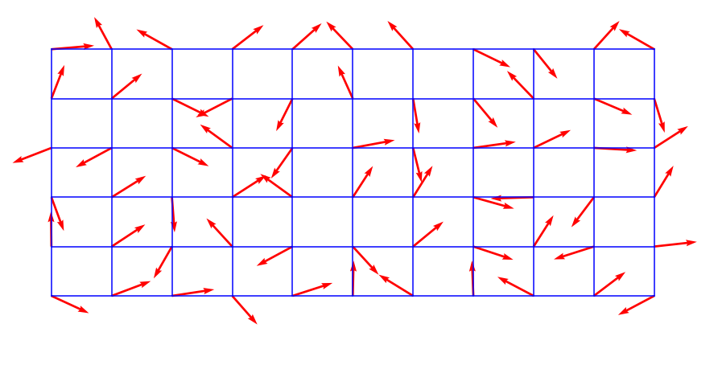

# Creating a terrain with p5.js

## Academic report

### Introducción:

En el marco de trabajo presentado por el profesor en clase, que enmarcaba varios tipos de ilusiones, nos llamó la atención el titulado __MACH BANDS__ , 
el cual se enfocaba en la generación de un terreno con una superficie natural con la aplicación del efecto nombrado.

Para lograr el objetivo utilizamos la libreria __p5.js__, la cual utilizaremos posiblemente durante los proyectos del semestre por recomendación del profesor
y no valemos de una libreria integrada de p5 llamada __Perlin noise__ para tratar de generar una textura natural para el terreno.

### Literatura:

#### p5.js:

Es una biblioteca de JavaScript para la codificación creativa, con un enfoque en la realización de la codificación accesible e inclusiva para artistas, diseñadores, educadores, principiantes y cualquier otra persona. P5.js es gratuito y de código abierto porque la filosofia de los creadores es que el  software, y las herramientas para aprenderlo, deben ser accesibles para todos.(p5js.org)

#### Perlin noise

Es un generador de secuencias aleatorias que produce una sucesión de números armónicos ordenados de forma más natural en compración con la función estándar aleatoria (). Fue inventado por Ken Perlin en la década de 1980 y se ha utilizado desde aplicaciones gráficas para producer textura de procedimiento, movimiento natural, formas, terrenos, etc. (p5js.org)

La mayor diferencia con random() es que perlin noise se define en un espacio N-dimensional infinito donde cada par de coordenadas corresponde a un valor semi-aleatorio fijo.

#### Metodos
